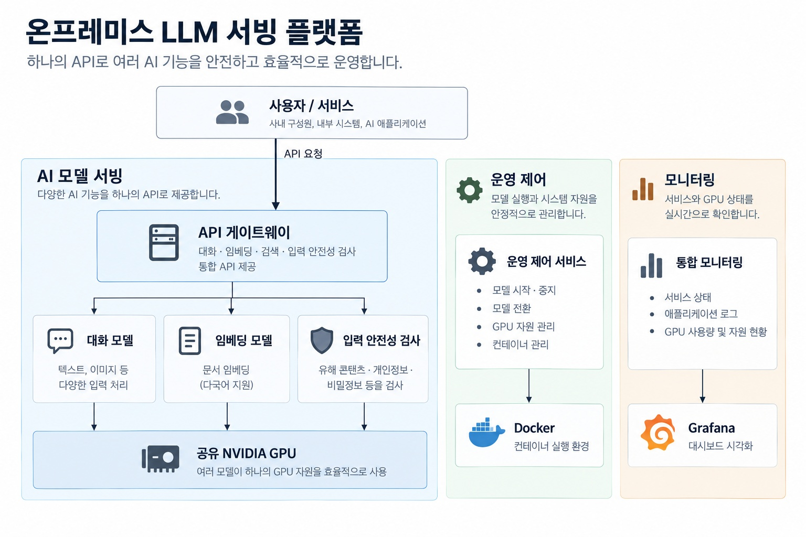
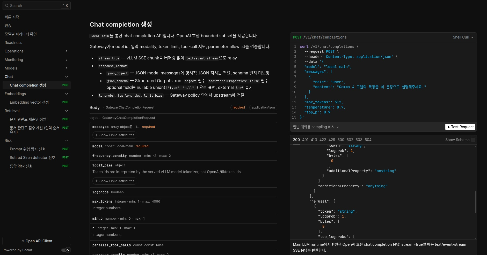

# AI 모델 서빙 플랫폼

GPU 기반 AI 모델을 **OpenAI-compatible API**로 제공하고, Chat, Embedding, Retrieval, Risk Detection, 모델 운영, 관측과 배포를 하나의 플랫폼에서 관리한다.

외부 애플리케이션은 Gateway를 통해 모델 기능을 사용하며, 모델 실행 환경은 vLLM을 기반으로 구성한다. 모델 실행·전환, GPU 자원, 서비스 상태와 배포 흐름은 플랫폼의 설정과 운영 도구를 통해 관리한다.

## 주요 기능

- OpenAI-compatible Chat / Embedding API
- 한국어 Retrieval
- Prompt 위험 탐지 / PII·Secret 위험 탐지
- Main Model 시작·중지·전환
- GPU 기반 vLLM 모델 실행
- Prometheus / Grafana / Loki 기반 관측
- GitHub Actions 기반 macOS·Ubuntu 검증·테스트, 기존 GitLab 이미지 빌드·배포 도구

## 시스템 구성

Gateway를 중심으로 모델 Runtime, Risk 처리, 운영 제어와 관측 서비스가 연결된다.



전체 구성과 서비스별 역할은 [시스템 구성](docs/03_system_components.md)에서 설명한다.

---

## 시작하기

### 로컬 애플리케이션 실행

Gateway와 Risk Adapter를 로컬 Python 프로세스로 실행한다. API, 인증, 요청 검증과 애플리케이션 로직을 확인할 때 사용한다. Python `>=3.12,<3.15`가 필요하다. [`.python-version`](.python-version)은 Linux 운영 기준 patch를 기록하며, macOS 개발은 같은 지원 minor의 설치 가능한 patch를 사용한다.

macOS에서 지원 Python이 없다면 먼저 설치한다.

```bash
brew install python@3.12
```

macOS와 Ubuntu에서 같은 개발 환경 준비 명령을 사용한다. `setup-dev`는 기존 `.venv`를 재사용하며 `.env`, 모델 캐시, 실행 중인 서비스는 변경하지 않는다. Docker와 GPU는 필요하지 않다.

```bash
make setup-dev
make validate
make test
```

Compose·배포 등 기존 운영 shell helper를 실행할 때는 Bash 4 이상이 별도로 필요하다. `make doctor-dev`로 실제 선택된 Python과 Bash를 확인할 수 있다.

애플리케이션을 실행할 때 환경 파일을 별도로 준비한다. `.env`가 이미 있다면 생성 단계를 생략한다.

```bash
make init-env-local
make start
make ready-local
```

종료:

```bash
make stop
```

### 전체 GPU 환경 실행

Gateway와 모델 Runtime, Risk Adapter, 모니터링 서비스를 Docker Compose로 함께 실행한다. Docker, NVIDIA GPU, NVIDIA Container Toolkit과 모델 다운로드에 필요한 Hugging Face credential을 사용한다.

소스 저장소를 처음 구성하는 경우:

```bash
HF_TOKEN=hf_xxx make first-run
source .venv/bin/activate
make compose-up
make ready-full
```

이미 환경과 이미지가 준비된 경우:

```bash
make compose-up
make ready-full
```

종료:

```bash
make compose-down
```

실행 구조와 네트워크 공개 방식은 [실행 환경과 모드](docs/04_runtime_modes.md), 설정 항목은 [설정 체계](docs/05_configuration.md)에서 확인한다. Release package를 서버에 적용하는 절차는 [배포](docs/10_deployment.md)에서 다룬다.

---

## 기본 API 확인

Gateway 기본 주소는 `http://127.0.0.1:9400`이다. 인증이 적용된 환경에서는 해당 프로파일의 Bearer token을 함께 사용한다.

Gateway는 브라우저에서 API를 확인할 수 있는 Scalar 기반 API Reference를 제공한다. Endpoint, 요청 필드와 응답 구조를 확인한 뒤 같은 API를 직접 호출할 수 있다.



### 상태 확인

```bash
curl -s http://127.0.0.1:9400/health
```

### 모델 목록

```bash
curl -s http://127.0.0.1:9400/v1/models
```

### Chat 요청

전체 GPU 환경의 준비가 완료된 상태에서 Main Model에 요청을 보낸다.

```bash
curl -s http://127.0.0.1:9400/v1/chat/completions \
  -H "Content-Type: application/json" \
  -d '{
    "model": "local-main",
    "messages": [
      {"role": "user", "content": "안녕하세요"}
    ],
    "max_tokens": 128
  }'
```

Embedding, Retrieval, Risk Detection, Streaming, 인증 방식과 전체 요청·응답 계약은 [API 인터페이스](docs/reference/api_reference.md)에서 확인한다. Gateway의 브라우저 API Reference와 OpenAPI 명세는 `/docs`, `/redoc`, `/openapi.json`에서 제공한다.

---

## 개발과 배포

GitHub의 `main` push와 Pull Request는 GitHub Actions에서 macOS·Ubuntu 정적 검증과 테스트를 실행한다. 워크플로는 로컬과 같은 `make setup-dev`, `make validate`, `make test`를 사용한다. 기존 GitLab 이미지 빌드·배포 경로는 별도로 유지되며, GitHub 검증 워크플로에서는 실행하지 않는다.

```text
Change
  ↓
Validate
  ↓
Test
  ↓
Build
  ↓
Deploy
```

Platform Image는 애플리케이션 변경을 반영하고, 모델 실행 환경에 영향을 주는 변경은 Unified vLLM Image 빌드 대상으로 이어질 수 있다. 배포는 생성된 immutable image digest를 기준으로 수행한다.

상세 Pipeline과 실행 조건은 [CI/CD](docs/09_cicd.md), Release 적용과 복구 절차는 [배포](docs/10_deployment.md)에서 설명한다.

---

## 주요 명령

| 목적 | 명령 |
|---|---|
| 개발 환경 준비 / 도구 진단 | `make setup-dev` / `make doctor-dev` |
| 로컬 애플리케이션 시작 / 종료 | `make start` / `make stop` |
| 로컬 상태 확인 | `make ready-local` |
| 전체 환경 시작 / 종료 | `make compose-up` / `make compose-down` |
| 전체 준비 상태 확인 | `make ready-full` |
| 설정·계약 검증 | `make validate` |
| 자동화 테스트 | `make test` |
| 대표 API 확인 | `make smoke` |
| Runtime 검증 | `make runtime-validate` |
| Compose 진단 | `make compose-diagnostics` |
| 전체 명령 안내 | `make help` |

개발 환경과 이미지 빌드는 [로컬 개발과 빌드](docs/07_local_dev_build.md), 검증 항목은 [테스트와 검증](docs/08_testing_validation.md)에서 설명한다.

---

## 프로젝트 구조

```text
src/        애플리케이션 코드
configs/    서비스·모델·GPU 설정
specs/      JSON Schema·OpenAPI
ops/        Compose·Runtime Image·모니터링
scripts/    Build·검증·배포·운영 도구
docs/       프로젝트 문서
assets/     아키텍처·문서 이미지
```

변경 영역과 함께 확인할 설정·검증·배포 범위는 [변경 가이드](docs/13_change_guide.md)에서 정리한다.

---

## 문서

| 문서 | 내용 |
|---|---|
| [문서 안내](docs/README.md) | 전체 문서 구성과 읽기 순서 |
| [API 인터페이스](docs/reference/api_reference.md) | API 계약, 요청·응답, 인증, 예제 |
| [vLLM Container 실행 가이드](docs/reference/vllm_container_guide.md) | vLLM Container 직접 실행과 API 요청 |
| [설정 체계](docs/05_configuration.md) | 설정 구조와 적용 방식 |
| [CI/CD](docs/09_cicd.md) | Pipeline과 이미지 생성·배포 연결 |
| [배포](docs/10_deployment.md) | Release 적용과 실패 복구 |
| [관측성](docs/11_observability.md) | 요청, Runtime, GPU, 로그 관측 |
| [운영 관리 및 장애 대응](docs/12_operations.md) | 운영 점검과 장애 진단·복구 |
| [변경 가이드](docs/13_change_guide.md) | 변경 영향과 검증·배포 범위 |
| [부록](docs/appendix.md) | 용어, 서비스·포트, 주요 명령, 주요 경로 |

---

## 버전과 변경 이력

현재 버전은 [`VERSION`](VERSION)을 기준으로 관리한다. 변경 이력은 [CHANGELOG](CHANGELOG.md)에서 확인한다.
