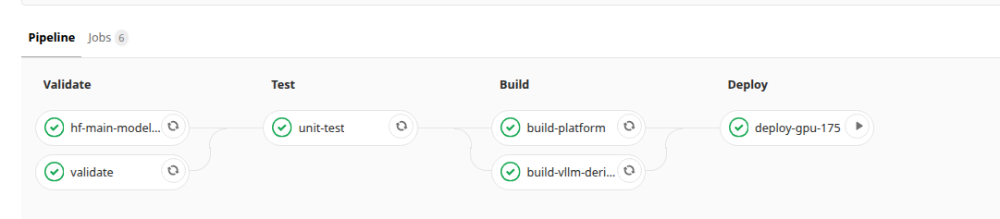

# 9. CI/CD

저장소와 CI는 실행 환경별 역할을 나눈다. GitHub는 현재 macOS 개발 환경의 원격 저장소와 app/contract 검증을 담당한다. [GitHub 검증 워크플로](../.github/workflows/validate.yml)는 `main` push, Pull Request, 수동 실행에서 macOS·Ubuntu의 `make setup-dev`, `make validate`, `make test`를 수행한다. Python은 `.python-version`의 Linux 운영 기준 patch에서 major.minor를 계산하고 OS별 제공 patch를 사용한다. 의존성은 `requirements.lock`, 지원 범위와 build backend는 `pyproject.toml`을 따른다. 이 워크플로는 외부 모델 다운로드, 이미지 push, GPU 서버 배포를 수행하지 않는다.

GitLab은 Ubuntu 운영 환경의 저장소 관리와 image build·GPU 배포를 담당한다. 아래 Build/Deploy 설명과 job 표, `.gitlab-ci.yml`은 현재 운영 경로다. 두 CI는 서로의 대체재가 아니며, 환경 간 이관은 동일 commit SHA 또는 명시적인 이관 commit으로 추적한다.

Pipeline의 기본 흐름은 다음과 같다.

```text
Repository Change
       ↓
    Validate
       ↓
      Test
       ↓
      Build
       ↓
     Deploy
```

| Stage | 수행 내용 | 다음 단계로 전달되는 결과 |
|---|---|---|
| `validate` | 설정, API contract, runtime 구성의 정합성 확인 | 검증된 source |
| `test` | application 동작과 contract 테스트 | test result |
| `build` | Platform image와 필요한 Unified vLLM image 생성 | registry image, immutable digest |
| `deploy` | build 결과를 대상 GPU 환경에 적용 | 실행 중인 release |

로컬 개발과 이미지 빌드는 [7. 로컬 개발과 빌드](./07_local_dev_build.md), 검증 항목의 상세 내용은 [8. 테스트와 검증](./08_testing_validation.md), 대상 서버에서의 실제 배포 절차는 [10. 배포](./10_deployment.md)에서 다룬다.

---

## 9.1 변경 유형별 파이프라인 흐름

Pipeline은 변경이 발생한 branch와 build 입력에 따라 실행 범위가 달라진다.

| 변경 상황 | 주요 실행 흐름 | 생성 결과 |
|---|---|---|
| 일반 branch | Validate → Test | validation / test result |
| `master` | Validate → Test → Platform Build | Platform image |
| `release` | Validate → Test → Platform Build | 배포 가능한 Platform image |
| `release` + Unified vLLM 입력 변경 | Validate → Test → Platform Build + Unified vLLM Build | Platform image + Unified vLLM image |
| `release` 배포 | 위 단계 완료 → Manual Deploy | GPU 환경에 release 적용 |
| tag | Validate → Test → Platform Build | version tag가 추가된 Platform image |
| tag + `BUILD_VLLM_DERIVED=1` | 위 단계 + Unified vLLM Build | Platform image + Unified vLLM image |

### 일반 애플리케이션 변경

Gateway, Risk Adapter, Admin Sidecar 등 Platform code를 변경하고 `master` 또는 `release`에 반영하면 Platform image가 생성된다.

```text
Application Change
      ↓
Validate
      ↓
Test
      ↓
Platform Image Build
      ↓
PLATFORM_IMAGE_DIGEST
```

`release` Pipeline에서는 생성된 Platform digest를 사용해 수동 배포를 실행할 수 있다.

### 통합 vLLM 런타임 변경

Unified vLLM Dockerfile, dependency lock, compatibility patch 또는 build configuration이 변경된 `release` Pipeline에서는 Platform image와 함께 Unified vLLM image를 생성한다.

```text
vLLM Runtime Change
      ↓
Validate / Test
      ↓
Platform Image Build
      +
Unified vLLM Build
      ↓
Platform Digest
      +
Unified vLLM Digest
      ↓
Manual Full Deploy
```

새 Unified vLLM digest가 생성된 Pipeline은 해당 runtime image를 배포 입력으로 함께 전달한다.

---

## 9.2 파이프라인 구성

현재 GitLab CI는 Validate, Test, Build, Deploy 단계로 구성된다.



위 화면은 실제 GitLab Pipeline 실행 예시다. Validate와 Test가 완료되면 Platform image와 필요한 Unified vLLM image를 빌드하고, 생성된 artifact를 Deploy 단계로 전달한다.

세부 job 구성은 다음과 같다.

```text
validate
  ├─ validate
  └─ hf-main-model-profiles (조건부)
       ↓
test
  └─ unit-test
       ↓
build
  ├─ build-platform
  ├─ build-vllm-derived (조건부)
  └─ build-vllm-derived-force (명시 실행)
       ↓
deploy
  └─ deploy-gpu-175 (release / manual)
```

CI 정의는 repository root의 `.gitlab-ci.yml`에서 관리한다.

Pipeline은 각 단계의 결과를 artifact로 전달한다.

```text
Source
  ↓
Validation / Test
  ↓
Registry Image
  ↓
Immutable Digest Artifact
  ↓
Deploy Job
```

---

## 9.3 검증과 테스트

Validate와 Test stage는 로컬에서 사용하는 검증 wrapper를 CI에서도 동일하게 실행한다.

### 정적 검증

```bash
PYTHON_BIN=python bash scripts/validation/run_validate.sh
```

주요 확인 영역은 다음과 같다.

- API contract와 OpenAPI
- configuration과 schema
- environment contract
- Compose projection과 exposure profile
- generated runtime artifact
- authentication profile

세부 검증 항목은 [8. 테스트와 검증](./08_testing_validation.md)을 참고한다.

### 메인 모델 프로필 호환성 확인

`hf-main-model-profiles` job은 다음 입력이 변경된 Pipeline에서 실행된다.

- `configs/main_model_profiles.yaml`
- `configs/vllm_unified_build.yaml`
- Main Model profile 검사 script
- vLLM compatibility resolver

이 job은 Unified vLLM configuration에 고정된 Transformers / Hugging Face Hub 버전으로 Main Model configuration을 읽어 profile compatibility를 확인한다.

### 단위·계약 테스트

```bash
PYTHON_BIN=python bash scripts/validation/run_test.sh
```

`unit-test` job은 application logic과 contract test를 실행한다. 테스트 구조와 검증 범위는 [8. 테스트와 검증](./08_testing_validation.md)에 정리되어 있다.

---

## 9.4 플랫폼 이미지 빌드

`build-platform`은 Gateway, Risk Adapter, Admin Sidecar 등 application/control-plane을 포함하는 Platform image를 생성한다.

```text
Validated Source
      ↓
Platform Image Build
      ↓
Image 내부 Application 검증
      ↓
Registry Push
      ↓
Immutable Digest
```

로컬과 CI는 공통 build script를 사용한다.

```text
scripts/build/build_platform_image.sh
```

CI build에서는 registry cache, CI tag, registry push, digest 추출이 추가된다.

### 이미지 태그

기본 image tag는 commit과 branch/ref를 기준으로 생성된다.

```text
platform:<CI_COMMIT_SHORT_SHA>
platform:<CI_COMMIT_REF_SLUG>
```

`release` branch와 tag Pipeline에서는 application `VERSION`을 기준으로 release tag도 생성한다.

```text
platform:release_<VERSION>
```

### 플랫폼 다이제스트 산출물

Registry push가 완료되면 실제 image content를 가리키는 digest를 추출한다.

```text
PLATFORM_IMAGE_DIGEST=<registry>/platform@sha256:...
```

이 값은 다음 artifact에 저장된다.

```text
build/platform-image.env
```

Artifact 보관 기간은 7일이며, `release` deploy job은 이 digest를 Platform image 입력으로 사용한다.

---

## 9.5 통합 vLLM 이미지 빌드

Main Model, Embedding, Korean Embedding, Prompt Risk runtime은 공통 Unified vLLM image를 사용한다.

일반 application 변경에서는 Platform image가 생성되고, Unified vLLM build 입력이 변경된 `release` Pipeline에서는 Unified vLLM image build가 추가된다.

```text
Application Change
  → Platform Image

vLLM Build Input Change
  → Platform Image
    + Unified vLLM Image
```

자동 build의 주요 변경 감지 대상은 다음과 같다.

- `.dockerignore`
- `ops/images/vllm-unified/Dockerfile`
- `ops/images/vllm-unified/requirements.media.lock`
- Gemma multimodal patch
- Llama `head_dim` compatibility patch
- `configs/vllm_unified_build.yaml`
- Unified vLLM build script
- compatibility resolver

GitLab의 `changes` 조건은 YAML 주석과 실제 build 입력을 구분하지 못한다. 따라서
`configs/vllm_unified_build.yaml`만 바뀐 Pipeline에서는 build script가 이전 revision과
현재의 base image·compatibility pin을 비교한다. 두 값이 같으면 job은 성공으로 끝나지만
base image pull, Docker build, registry push와 새 digest 생성은 수행하지 않는다. Dockerfile,
patch, media dependency처럼 다른 build 입력이 함께 바뀐 경우에는 항상 새 image를 만든다.

실제 image build와 registry push는 다음 script에서 수행한다.

```text
scripts/ci/build_vllm_derived_images.sh
```

### 통합 vLLM 다이제스트 산출물

실제로 image build가 완료된 경우에만 다음 artifact가 생성된다.

```text
build/vllm-unified-image.env
```

내용은 registry의 immutable digest이다.

```text
VLLM_UNIFIED_IMAGE_DIGEST=<registry>/vllm-unified@sha256:...
```

이 digest는 해당 Pipeline에서 생성한 Unified vLLM image를 배포 runtime에 동일하게 적용하는 기준이 된다.

### 명시적 재빌드

자동 변경 감지 이외의 Unified vLLM rebuild는 Pipeline variable로 요청한다.

```text
BUILD_VLLM_DERIVED=1
```

`release` 또는 tag Pipeline에서 `build-vllm-derived-force`가 실행된다.

주요 사용 사례는 다음과 같다.

- 과거 source 기준 runtime image 재생성
- tag 기준 Unified vLLM image 생성
- 명시적인 runtime rebuild

---

## 9.6 빌드 결과물과 불변 다이제스트

Build stage에서 Deploy stage로 전달되는 핵심 값은 image digest다.

```text
Source Commit
     ↓
Container Image
     ↓
Registry Push
     ↓
sha256 Digest
     ↓
Deploy Input
```

| Artifact | 포함 값 | 용도 |
|---|---|---|
| `build/platform-image.env` | `PLATFORM_IMAGE_DIGEST` | Platform 배포 image 지정 |
| `build/vllm-unified-image.env` | `VLLM_UNIFIED_IMAGE_DIGEST` | 새 Unified vLLM runtime image 지정 |

Image tag와 digest의 역할은 다음과 같다.

| 구분 | 예시 | 역할 |
|---|---|---|
| Image Tag | `platform:release_0.0.1` | 사람이 확인하는 version/ref 식별 |
| Image Digest | `platform@sha256:...` | registry image content의 immutable 식별 |

Deploy stage는 Platform image를 digest로 전달한다.

```text
build-platform
     ↓
PLATFORM_IMAGE_DIGEST
     ↓
deploy-gpu-175
     ↓
PLATFORM_IMAGE_TO_DEPLOY
```

이번 Pipeline에서 Unified vLLM image가 새로 생성된 경우 해당 digest도 함께 전달된다.

```text
build-vllm-derived
       ↓
VLLM_UNIFIED_IMAGE_DIGEST
       ↓
deploy-gpu-175
       ↓
VLLM_UNIFIED_IMAGE_TO_DEPLOY
```

Unified vLLM artifact가 없는 Pipeline은 대상 환경에 설정된 기존 runtime image pin을 사용한다.

---

## 9.7 배포 파이프라인

`deploy-gpu-175` job은 `release` branch에서 수동으로 실행한다.

```text
Release Pipeline
      ↓
Platform Digest
      +
Optional Unified vLLM Digest
      +
Deployment Configuration
      ↓
Manual Deploy
      ↓
Target GPU Environment
```

Deploy job은 `build/platform-image.env`를 필수 입력으로 사용한다. Unified vLLM artifact가 존재하면 함께 로드한다.

### 배포 방식

기본 mode는 `full`이다.

```text
DEPLOY_MODE=full
```

Platform application/control-plane만 갱신하는 배포는 Pipeline 실행 시 다음 값을 지정할 수 있다.

```text
DEPLOY_MODE=rolling
```

이번 Pipeline에서 새로운 Unified vLLM digest가 생성되면 deploy script는 `full` mode를 적용한다.

```text
Fresh Unified vLLM Digest
          ↓
       Full Deploy
```

대상 서버에서 수행되는 release staging, Compose 수렴, runtime readiness와 rollback은 [10. 배포](./10_deployment.md)에서 설명한다.

---

## 9.8 파이프라인 실행 규칙

주요 job의 실행 조건은 다음과 같다.

| Job | 실행 조건 | 주요 결과 |
|---|---|---|
| `validate` | 기본 Pipeline | validation result |
| `hf-main-model-profiles` | Main Model profile / vLLM compatibility 입력 변경 | profile compatibility result |
| `unit-test` | 기본 Pipeline | test result |
| `build-platform` | `master`, `release`, tag | Platform image digest |
| `build-vllm-derived` | `release` + Unified vLLM build 입력 변경 | Unified vLLM digest |
| `build-vllm-derived-force` | `release` 또는 tag + `BUILD_VLLM_DERIVED=1` | Unified vLLM digest |
| `deploy-gpu-175` | `release` + manual 실행 | GPU 환경 배포 |

Pipeline 실행 범위를 다시 요약하면 다음과 같다.

```text
Feature / 일반 Branch
  → Validate → Test

master
  → Validate → Test → Platform Build

release
  → Validate → Test → Platform Build
  → vLLM 입력 변경 시 Unified vLLM Build
  → Manual Deploy

Tag
  → Validate → Test → Platform Build
  → BUILD_VLLM_DERIVED=1이면 Unified vLLM Build
```

---

## 9.9 파이프라인 입력과 자격 증명

CI/CD Variable은 build와 deploy에 필요한 환경별 값을 Pipeline에 전달한다.

| 구분 | 역할 | 대표 값 |
|---|---|---|
| Registry | image push/pull 인증 | GitLab registry credentials |
| Build option | Unified vLLM rebuild 제어 | `BUILD_VLLM_DERIVED` |
| Deployment target | 대상 GPU host와 SSH 연결 | deploy host/user/key |
| Deployment option | 배포 mode와 runtime 구성 | `DEPLOY_MODE`, runtime profile 등 |

GitLab predefined variable은 commit, branch, registry 경로와 image tag 생성에 사용한다.

주요 값은 다음과 같다.

| 값 | 역할 |
|---|---|
| `CI_REGISTRY_IMAGE` | 프로젝트 Container Registry 경로 |
| `CI_COMMIT_SHORT_SHA` | commit 기반 image tag |
| `CI_COMMIT_REF_SLUG` | branch/ref 기반 image tag |
| `CI_COMMIT_SHA` | deploy release identifier |
| `BUILD_VLLM_DERIVED` | Unified vLLM 명시적 rebuild 요청 |

환경별 secret과 private credential은 GitLab CI/CD Variable에서 관리한다. 배포 변수의 세부 사용 방법은 [10. 배포](./10_deployment.md)에서 다룬다.

---

## 9.10 재실행과 실패 확인

Pipeline 실패 시에는 실패 stage의 입력과 생성되어야 할 artifact를 함께 확인한다.

| 상황 | 확인 항목 |
|---|---|
| Validate 실패 | validation message와 변경된 config/schema/generated artifact |
| Main Model profile 검사 실패 | profile, compatibility pin, HF model configuration |
| Test 실패 | 실패 test와 관련 application 변경 |
| Platform Build 실패 | Docker build log, registry login, image verification |
| Platform digest artifact 없음 | `build-platform` 성공 여부와 `build/platform-image.env` |
| vLLM 입력 변경 후 build 미실행 | 변경 파일이 자동 감지 대상에 포함되는지 확인 |
| Unified vLLM Build 실패 | base image, compatibility pin, patch/lock 입력, registry push |
| Unified vLLM 강제 build 미실행 | branch/tag 조건과 `BUILD_VLLM_DERIVED=1` |
| Deploy가 `full`로 선택됨 | 이번 Pipeline의 신규 Unified vLLM digest 생성 여부 |
| Manual Deploy 실행 대상 없음 | 현재 Pipeline이 `release` branch인지 확인 |
| Deploy artifact loading 실패 | Platform / Unified vLLM digest artifact 형식 |

### 빌드 재실행

Platform image는 대상 branch 또는 tag의 Pipeline을 다시 실행해 동일한 build script로 생성한다.

Unified vLLM image의 명시적 재생성에는 다음 variable을 사용한다.

```text
BUILD_VLLM_DERIVED=1
```

### 배포 재실행

`deploy-gpu-175`는 수동 job이며 같은 Pipeline의 build artifact를 사용한다. 대상 환경에서의 배포 실패와 복구 절차는 [10. 배포](./10_deployment.md)를 참고한다.

---

## 9.11 주요 파일

| 영역 | 파일 | 역할 |
|---|---|---|
| Pipeline 정의 | `.gitlab-ci.yml` | stage, job, artifact, 실행 조건 정의 |
| Platform image build | `scripts/build/build_platform_image.sh` | Platform image build와 application verification |
| Unified vLLM build | `scripts/ci/build_vllm_derived_images.sh` | Unified vLLM image build, registry push, digest 생성 |
| Deploy entrypoint | `scripts/ci/deploy_gitlab_compose.sh` | CI artifact와 deploy configuration을 대상 환경에 적용 |
| Deploy request policy | `scripts/lib/deploy_request_policy.sh` | deploy mode와 요청 조건 결정 |
| Deploy convergence policy | `scripts/lib/deploy_recreate_policy.sh` | 변경된 runtime/service의 재생성 범위 계산 |
| Validation | `scripts/validation/run_validate.sh` | CI와 로컬의 공통 정적 검증 entrypoint |
| Test | `scripts/validation/run_test.sh` | CI와 로컬의 공통 test entrypoint |

관련 문서:

- [5. 설정 체계와 Source of Truth](./05_configuration.md)
- [7. 로컬 개발과 빌드](./07_local_dev_build.md)
- [8. 테스트와 검증](./08_testing_validation.md)
- [10. 배포](./10_deployment.md)
